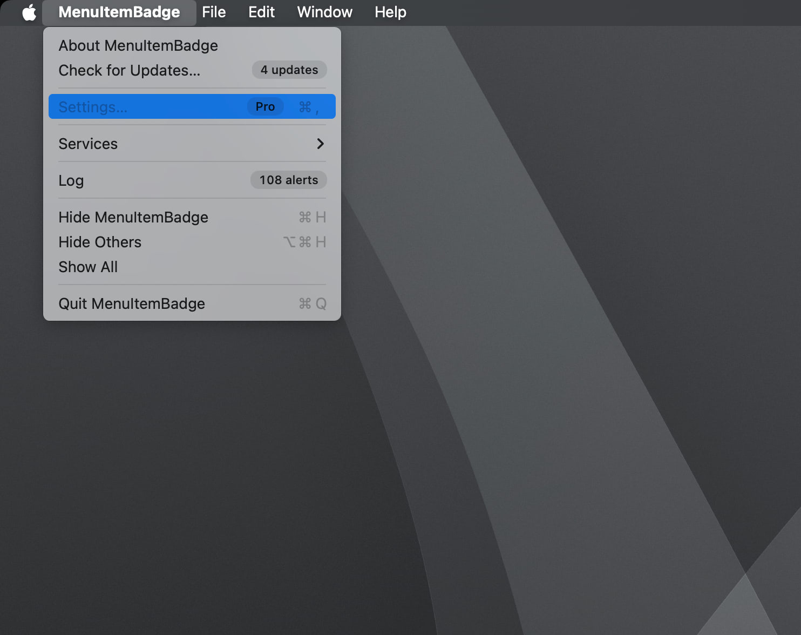
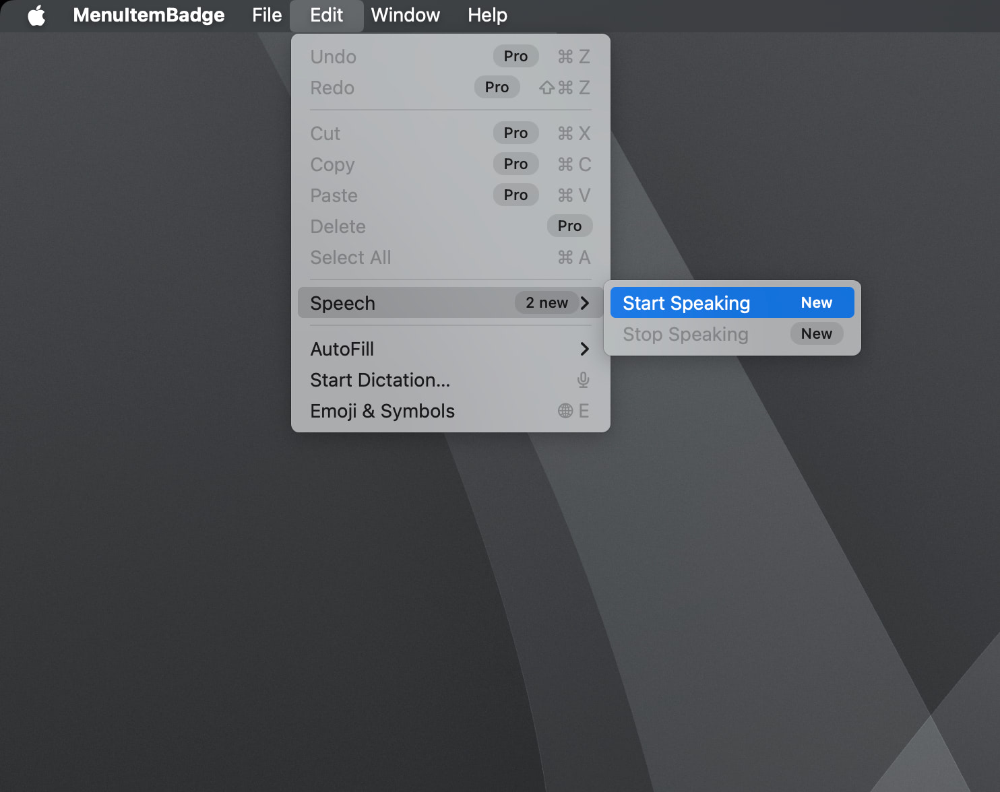
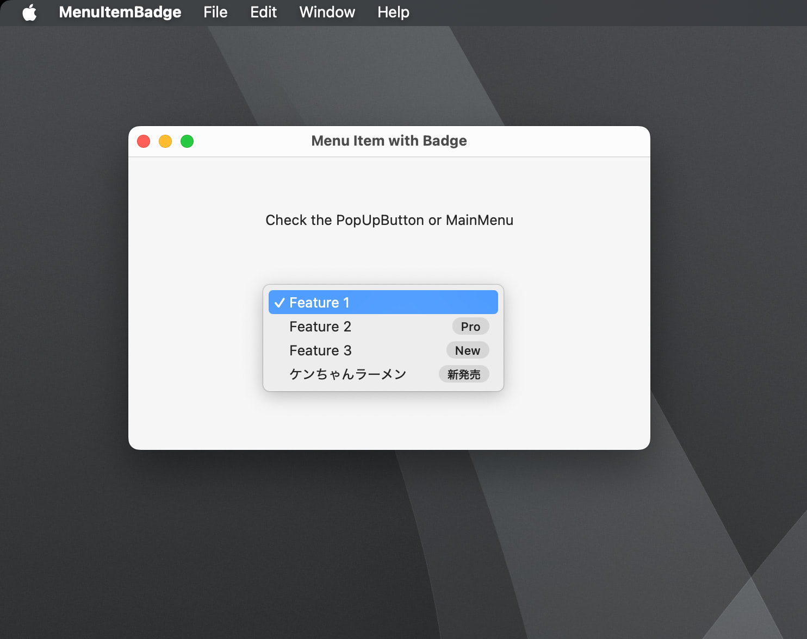
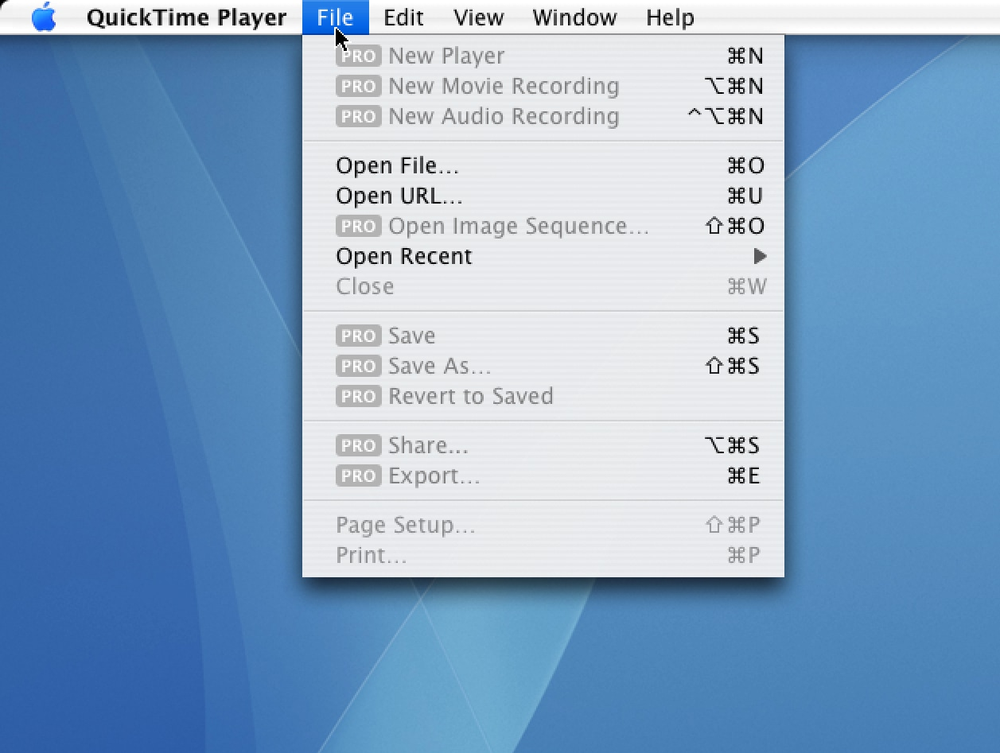

# MenuItemBadge

Does anyone remember the “PRO” label on the QuickTime Player’s menu bar from Mac OS X Tiger?

Now on macOS 14 and later, we can easily get that badge with [NSMenuItemBadge](https://developer.apple.com/documentation/appkit/nsmenuitembadge).

QuickTime Player on Mac OS X Tiger (not pro version)

